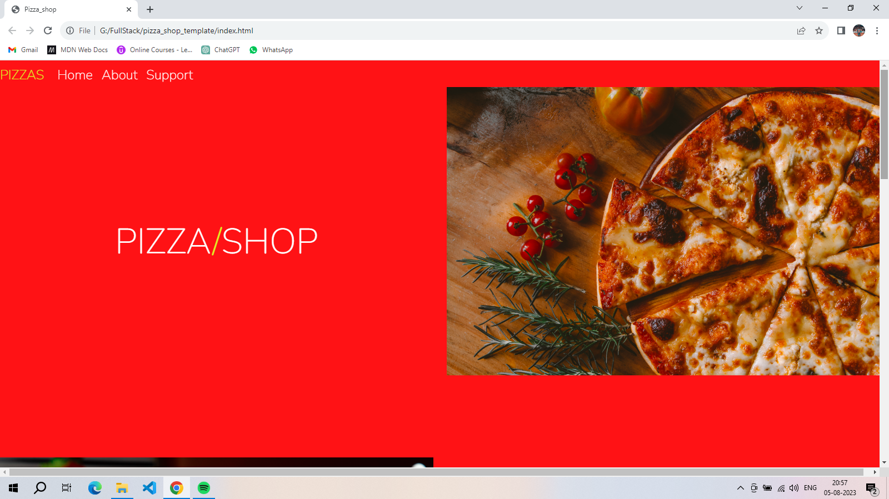
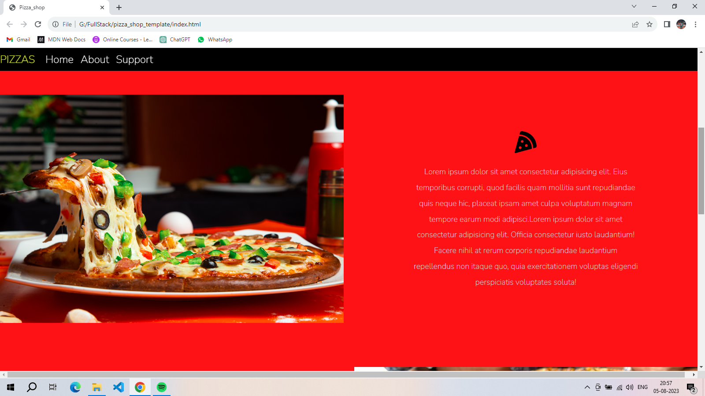
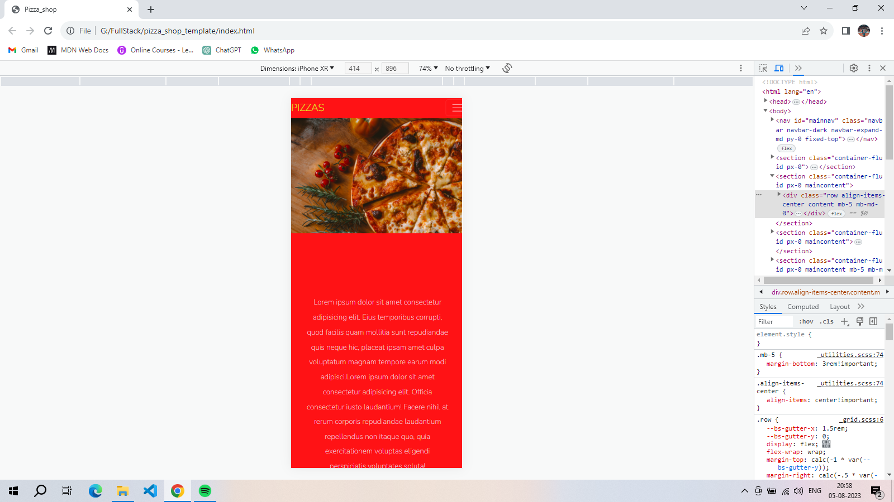
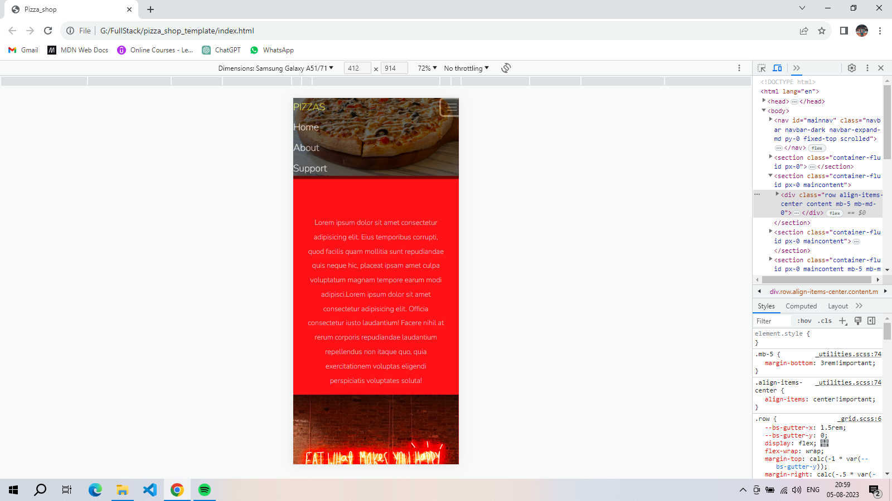

#Pizza Shop Template
A responsive website template for pizza restaurants and delivery services. It looks modern and adapts beautifully across mobile and desktop devices. Built with HTML, CSS, and Bootstrap. Images used are from Unsplash.

#Installation
Clone this repository.
Open index.html in your web browser.

#Customization
Replace images in the img folder with your own.
Modify content in index.html
Customize CSS styles in the app.cs

#Credits
Images: Unsplash

